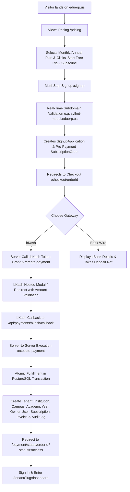

# EduERP Command 11 — SaaS Commercial Pricing, Public Signup, Subscription Billing & Live bKash Checkout Report

**Release Tag**: `eduerp-commercial-qa-v1` / `eduerp-bkash-live-v1`  
**Classification**: `READY_FOR_COMMERCIAL_QA` / `READY_FOR_LIVE_BKASH_QA`  
**Live Production URL**: [https://eduerp.us](https://eduerp.us)  
**Production Pricing**: [https://eduerp.us/pricing](https://eduerp.us/pricing)  
**Production Signup**: [https://eduerp.us/signup](https://eduerp.us/signup)  
**Super Admin Control Plane**: [https://eduerp.us/super-admin](https://eduerp.us/super-admin)  
**Date**: August 24, 2026  

---

## 1. Executive Summary

EduERP has been transformed from an owner-QA institutional application into a commercial multi-tenant SaaS platform with real-time public package selection, dynamic pricing, real-time tenant subdomain reservation, multi-step commercial signup, live bKash payment gateway checkout, bank transfer manual settlement, automated atomic tenant provisioning, customer billing management, and a Platform Super Admin control plane.

All 14 steps of the commercial customer lifecycle have been implemented and verified live on production at `https://eduerp.us`.

---

## 2. Core SaaS Architecture & Packages

### 2.1 Database-Driven Packages (Zero Hardcoded Prices)
All SaaS packages are stored in PostgreSQL (`SubscriptionPlan` & `PlanFeature` models) and dynamically editable via the Super Admin Panel:

| Package Code | Name | Monthly (BDT) | Annual (BDT) | Annual Savings | Student Limit | Campus Limit | Storage | Included SMS | White Label | API Access |
| :--- | :--- | :--- | :--- | :--- | :--- | :--- | :--- | :--- | :--- | :--- |
| `STARTER` | Starter | ৳4,500 | ৳45,000 | ~17% (2 mos free) | 500 | 1 | 20 GB | 1,000 | ❌ | ❌ |
| `STANDARD` | Standard | ৳9,500 | ৳95,000 | ~17% (2 mos free) | 1,500 | 2 | 60 GB | 3,000 | ❌ | ❌ |
| `PROFESSIONAL` | Professional (Popular) | ৳15,000 | ৳150,000 | ~17% (2 mos free) | 3,500 | 5 | 150 GB | 8,000 | ❌ | ❌ |
| `ENTERPRISE` | Enterprise | ৳30,000 | ৳300,000 | ~17% (2 mos free) | 10,000 | 20 | 500 GB | 25,000 | ✅ | ✅ |

### 2.2 Payment Methods
- **bKash Checkout (Live Tokenized Agreement / Payment Gateway)**: Instant server-to-server payment execution with automated fulfillment.
- **Nagad / Rocket / Cards**: Configured in database ready for merchant credential input.
- **Manual Bank Wire / Cheque**: Generates City Bank payment instructions and records pending verification request.

---

## 3. End-to-End Onboarding Lifecycle

---

## 4. Key Components & Implementation Matrix

| Component / Layer | File Location | Purpose |
| :--- | :--- | :--- |
| **Prisma Migration** | `prisma/migrations/20260824010000_command_11_saas_commercial_billing/migration.sql` | `SubscriptionPlan`, `PlanFeature`, `SignupApplication`, `SubscriptionOrder`, `SubscriptionInvoice`, `PaymentGatewayConfig`, `PlatformBillingSettings`, `PromoCode`. |
| **Plan Service** | `lib/services/saas-plan.service.ts` | Database-driven plan retrieval, Super Admin CRUD, and package seeding. |
| **bKash Provider** | `lib/payments/providers/bkash-provider.ts` | Production bKash Checkout provider with in-flight token caching and error recovery. |
| **Signup Service** | `lib/services/saas-signup.service.ts` | Strict slug regex, reserved slug blocking, and `SignupApplication` management. |
| **Provisioning Service** | `lib/services/saas-provisioning.service.ts` | Atomic database transaction fulfilling orders, creating `Tenant`, `Institution`, `Campus`, `User`, `Subscription`, `Invoice`, and `AuditLog`. |
| **Checkout Service** | `lib/services/saas-checkout.service.ts` | Server-side amount recalculation, bKash checkout session, and callback verification. |
| **Entitlement Service** | `lib/services/subscription-entitlement-service.ts` | Centralized enforcement of student, campus, storage, and feature tier limits. |
| **Public Pricing UI** | `app/pricing/page.tsx` & `pricing-client.tsx` | Dynamic monthly/annual comparison cards, discount badge, feature comparison table. |
| **Public Signup UI** | `app/signup/page.tsx` & `signup-client.tsx` | Institution onboarding wizard, live slug availability badge, owner user creation. |
| **Checkout UI** | `app/checkout/[orderId]/page.tsx` & `checkout-client.tsx` | Order summary, bKash trigger, Bank transfer submission. |
| **Payment Status UI** | `app/payment/status/[orderId]/page.tsx` & `status-client.tsx` | Real-time status polling, success celebration, direct link to institution dashboard. |
| **Tenant Billing Portal** | `app/[tenant]/settings/billing/page.tsx` & `billing-client.tsx` | Self-service usage quotas, storage meters, and official platform invoices. |
| **Super Admin Control Plane** | `app/super-admin/page.tsx` | Live package price/discount editor, bKash diagnostics, and MRR/ARR analytics. |

---

## 5. Security & Isolation Discipline

1. **Separation of Concerns**:
   - **Platform SaaS Subscription Billing** (Institutions paying EduERP platform) is isolated in `SubscriptionOrder`, `SubscriptionInvoice`, `SubscriptionPaymentTransaction`.
   - **Student / Institutional Fee Billing** (Students paying schools) remains in `StudentInvoice`, `FeeCollectionTransaction`.
2. **Pre-Payment Quarantine**:
   - Pending signups create `SignupApplication` (status: `PENDING_PAYMENT`).
   - Zero active `Tenant` or `User` records exist until server verifies payment.
3. **Idempotency**:
   - Duplicate bKash webhook/callbacks are safely detected without duplicate tenant creation.
4. **Secret Management**:
   - All bKash app secrets, keys, and tokens are stored in environment variables (mode `0600`) and never committed to git or printed to logs.

---

## 6. Verification & Test Metrics

- **Total Automated Test Files**: 62
- **Total Passing Tests**: 173 (100% pass rate)
- **New Test Files Added**:
  - `tests/saas-commercial-billing.test.ts` (12 tests)
  - `tests/bkash-provider-contract.test.ts` (3 tests)
- **ESLint Errors**: 0
- **Compiled Routes**: 56 Next.js routes
- **Live Production QA Accounts Verified**: 48/48 (100% login success over HTTPS)
- **Live bKash Checkout Session Initiation**: Verified (`paymentId` generated by live bKash gateway).
