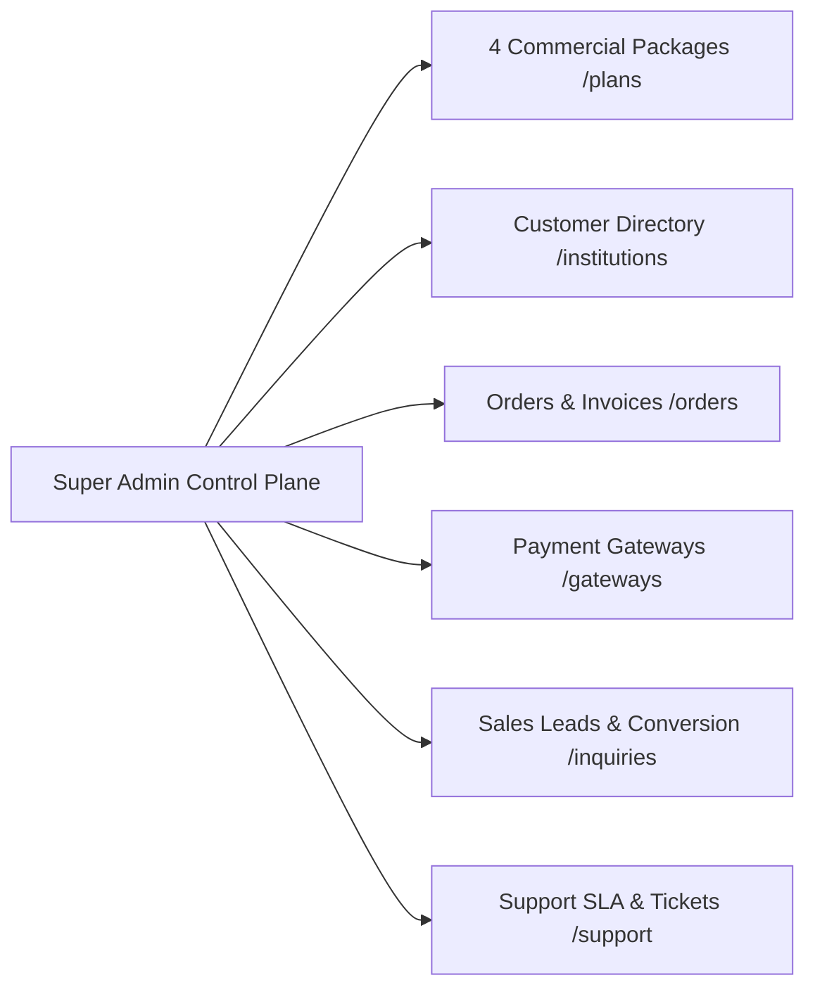

# EduERP SaaS Billing & Platform Administration Guide

## 1. SaaS Control Plane Overview
The EduERP SaaS Control Plane (`https://eduerp.us/super-admin`) provides complete management of commercial packages, subscription lifecycles, payment gateways, usage metering, and tenant entitlements.



---

## 2. 4 Commercial Subscription Packages
EduERP pricing and entitlements are entirely database-driven (`SubscriptionPlan` in PostgreSQL). Prices, limits, and features can be edited directly in `/super-admin/plans` without redeploying code.

| Package | Code | Monthly Price | Annual Price | Max Students | Max Campuses | Max Teachers | Storage (GB) | Included SMS | Target Audience |
|---|---|---|---|---|---|---|---|---|---|
| **Starter** | `STARTER` | ৳4,500 | ৳45,000 | 500 | 1 | 25 | 20 GB | 1,000 | Small primary/secondary schools, coaching centers |
| **Standard** | `STANDARD` | ৳9,500 | ৳95,000 | 1,500 | 2 | 60 | 60 GB | 3,000 | Established schools, colleges, madrashas |
| **Professional** | `PROFESSIONAL` | ৳15,000 | ৳150,000 | 3,500 | 5 | 150 | 150 GB | 8,000 | Large multi-campus schools, colleges, polytechnics |
| **Enterprise** | `ENTERPRISE` | ৳30,000 | ৳300,000 | 10,000 | 20 | 500 | 500 GB | 25,000 | Universities, large educational groups & foundations |

---

## 3. Server-Side Entitlement & Limit Enforcement Engine
EduERP guarantees strict boundary isolation and entitlement checks server-side:

### Feature Protection (`requireTenantFeature`)
Protected modules (e.g. `PAYROLL`, `LMS`, `HIFZ`, `UNIVERSITY`, `GOV_COMPLIANCE`, `CUSTOM_DOMAIN`) verify that the tenant's package tier includes the required capability or has an active feature override. If not, the API returns:
```json
{
  "success": false,
  "error": "Feature 'LMS' is not included in your institution's Starter package. Please upgrade your package in Settings → Billing to access this module.",
  "code": "FEATURE_NOT_INCLUDED",
  "upgradeUrl": "/settings/billing"
}
```

### Plan Resource Limits (`requireTenantLimit`)
Hard limits on student capacity, campus count, and staff roster are checked on creation:
- `checkLimit(tenantId, 'STUDENTS')`
- `checkLimit(tenantId, 'CAMPUSES')`
- `checkLimit(tenantId, 'TEACHERS')`

### Downgrade Eligibility Verification
When a customer requests a plan downgrade, `checkDowngradeEligibility(tenantId, targetPlanId)` validates that the current student count, campus count, and staff roster do not exceed the target package limits. If exceeded, the downgrade is safely blocked with actionable guidance (`DOWNGRADE_BLOCKED_BY_USAGE`).

---

## 4. Manual Offline Payment Recording & Activation
For institutional clients paying via Cheque, Bank Deposit, or Direct Wire:
1. Navigate to `/super-admin/institutions` -> Select Institution -> **Record Offline Payment**.
2. Enter Payment Method (`BANK_TRANSFER`, `CHEQUE`, `CASH`), Amount (BDT), Reference Number, Duration, and Approval Notes.
3. The system atomically creates an `OfflinePaymentRecord`, generates a `SubscriptionInvoice` (`INV-MAN-2026-XXXX`), activates the `Subscription`, and logs an audited event.

---

## 5. Temporary Feature Overrides for Pilot Institutions
For institutions conducting pilot evaluations:
1. Super Admin can grant a temporary feature override (`TenantFeatureOverride`) with a specific expiry date (e.g. 30 days) and justification.
2. The override grants immediate access to the specified engine (e.g. `LMS_COMPLETE`) without altering their base package.
3. Overrides can be revoked or extended at any time with complete audit trail logging.

---

## 6. Lead-to-Customer Conversion Workflow
Prospects who submit contact inquiries through the public portal (`/contact`) appear in `/super-admin/inquiries`:
1. Open the inquiry in the **Inquiry Inspector**.
2. Click **"Convert to Customer (Onboard)"**.
3. All details (Institution Name, Contact Person, Email, Mobile, District, Institution Type) are automatically prefilled into the manual tenant provisioning wizard.
