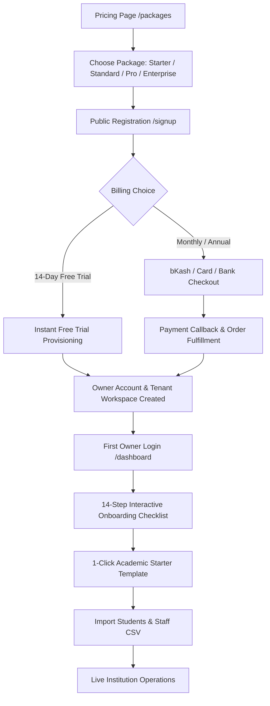

# EduERP Commercial Tenant Onboarding Guide

## 1. Overview & Institutional Self-Serve Journey
EduERP enables educational institutions across Bangladesh and globally to onboard seamlessly without requiring manual database intervention.

A new institution can register, choose a tailored vertical package, select a billing cycle or start a 14-day free trial, and begin operating immediately:

---

## 2. Supported Institutional Engines (8 Verticals)
EduERP adapts its terminology, stage workflows, and vertical-specific tools based on the chosen institution type:

1. **Primary & Secondary School (`SCHOOL`)**:
   - Classes 1 to 10 with sections (Padma, Meghna, Jamuna, etc.).
   - Morning & Day shifts.
   - Standard National Curriculum (NCTB) subjects and GPA grading (A+, A, A-, B, C, D, F).

2. **Higher Secondary & Degree College (`COLLEGE`)**:
   - Classes 11 & 12 (HSC) with Science, Humanities, and Business Studies stream combinations.
   - Compulsory subjects (Bangla, English, ICT) + 3 Main electives + 4th Optional subject with 2-point GPA bonus calculation.

3. **Combined School & College (`SCHOOL_AND_COLLEGE`)**:
   - Unified governance for Classes 1 through 12 across primary, secondary, and higher secondary sections.

4. **Madrasha (`MADRASHA`)**:
   - Ibtedayi (1–5), Dakhil (6–10), and Alim (11–12) curricula.
   - Integrated **Hifzul Quran 30-Para Progress Tracker** with daily Sabak, Sabki, and Manzil scoring.

5. **University & Higher Education (`UNIVERSITY`)**:
   - Semester / Trimester structure with credits.
   - Faculty research, thesis defense, workload management, and prerequisite waiver workflows.

6. **Polytechnic Institute (`POLYTECHNIC`)**:
   - 8-Semester Diploma in Engineering curricula (CSE, Electrical, Civil, Mechanical).
   - Industrial attachment, practical lab assessments, and BTEB compliance exports.

7. **Technical & Vocational Institute (`TECHNICAL_INSTITUTE`)**:
   - Trade courses, modular skill certifications, and apprenticeship tracking.

8. **Professional Training Institute (`TRAINING_INSTITUTE`)**:
   - Short courses, corporate training batches, quiz evaluations, and verifiable certificate issuance.

---

## 3. The 14-Step Persistent Onboarding Checklist
When an institution owner signs in for the first time, the **Tenant Onboarding Wizard** guides them step-by-step with real-time completion tracking:

| Step # | Milestone | Key Actions | Route |
|---|---|---|---|
| **Step 1** | **Institution Profile** | Enter official name, address, phone, email, EIIN, and board affiliation | `/[tenant]/settings` |
| **Step 2** | **Branding & Logo** | Upload official crest/logo, header banner, and primary institutional colors | `/[tenant]/settings` |
| **Step 3** | **Academic Calendar** | Define active academic year (e.g. AY-2026), term dates, and working days | `/[tenant]/academics` |
| **Step 4** | **Campus Infrastructure** | Configure main campus, classroom capacities, buildings, and branch locations | `/[tenant]/facilities` |
| **Step 5** | **Classes & Programs** | Set up grade levels (e.g. Class 1–10) or degree programs | `/[tenant]/academics` |
| **Step 6** | **Sections & Shifts** | Create section divisions (Sec A, Sec B), shifts (Morning/Day), and assigned teachers | `/[tenant]/academics` |
| **Step 7** | **Curriculum & Subjects** | Assign subjects, credit hours, and subject code mappings | `/[tenant]/academics` |
| **Step 8** | **Staff & Faculty** | Add teachers, staff designations, and salary pay grades | `/[tenant]/hr` |
| **Step 9** | **Fee Structure** | Configure tuition fees, admission charges, and monthly billing heads | `/[tenant]/finance` |
| **Step 10** | **Admission Portal** | Set up online application portal, admission tests, and intake quotas | `/[tenant]/admission` |
| **Step 11** | **Payment Gateway** | Connect bKash Merchant account, Nagad, or Bank deposit accounts | `/[tenant]/settings/billing` |
| **Step 12** | **Student SIS Roster** | Import student roster via CSV/Excel template or add first batch | `/[tenant]/students` |
| **Step 13** | **Notification Alerts** | Configure SMS gateway, parent SMS alerts, and circulars | `/[tenant]/communication` |
| **Step 14** | **Review & Go Live** | Audit complete setup checklist and publish live institution operations | `/[tenant]/dashboard` |

---

## 4. 1-Click Academic Starter Templates
Rather than creating 10+ classes and 30+ subjects manually, the owner can click **"Load Template"** in the Onboarding Wizard to instantly generate:
- Complete class and section hierarchy.
- Shifts and session calendar.
- Zero fake student or finance data is created—preserving a 100% clean commercial ledger.

---

## 5. First-Login Temporary Password Reset
When an institution is provisioned manually by a Super Admin:
1. The administrator account receives a cryptographically generated temporary password.
2. Upon first login, the user is presented with the **Mandatory Password Change Modal**.
3. Once the owner sets their private password (min 8 characters), full workspace access is granted.
